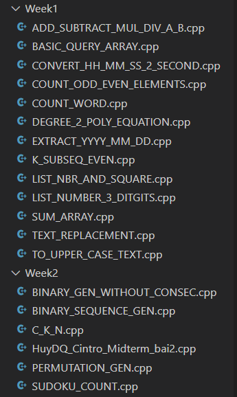
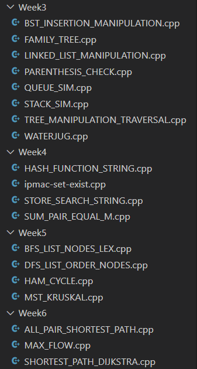
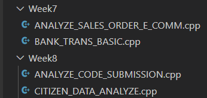
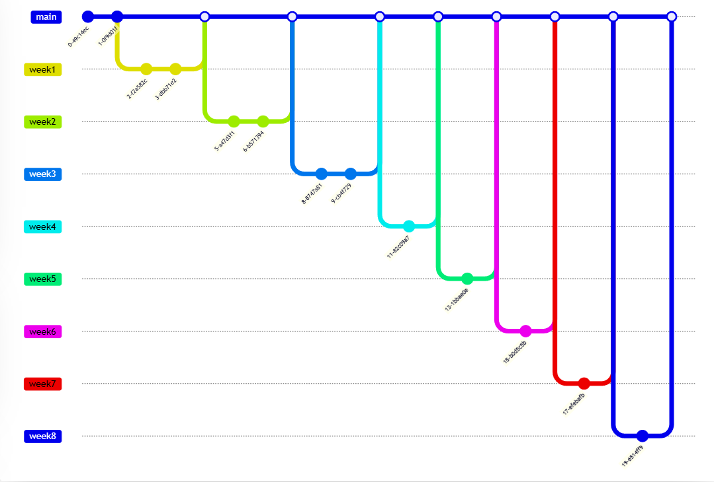

# Project1_Stage1

Author : Chử Quang Thành

## 1. Week 1 -> 6: Một số thuật toán cơ bản
Các thuật toán được đề cập đến

+ Nhập xuất dữ liệu
+ Đệ quy và đệ quy quay lui
+ Danh sách liên kết, Hàng đợi
+ Cây
+ Tìm kiếm
+ Đồ thị

## 2. Week 7 -> 8: Một số truy vấn về vấn đề thực tế

Các vấn đề được đề cập đến
+ Truy vấn số điện thoại, gia phả của gia tộc
+ Truy vấn về bài làm của học sinh, Thông tin thành phố

## 3. Network graph trong git

